# Interactive unsupervised object classification in Napari

In this exercise we will perfom [Feature Extraction](https://focalplane.biologists.com/2023/05/03/feature-extraction-in-napari/), Dimensionality Reduction with [UMAP](https://umap-learn.readthedocs.io/en/latest/#) and Clustering with [HDBSCAN](https://hdbscan.readthedocs.io/en/latest/index.html) to assign objects (nuclei) to different classes in napari.
We will use the napari plugin [napari-clusters-plotter plugin](https://github.com/BiAPoL/napari-clusters-plotter?tab=readme-ov-file#napari-clusters-plotter).

## Getting started

Open a terminal window and activate your conda environment:

```
mamba activate my_first_env
```

Afterwards, start up Napari:

```
napari
```

Load the "human-mitosis" example dataset from the menu `File > Open Sample > napari builtins > Human Mitosis`

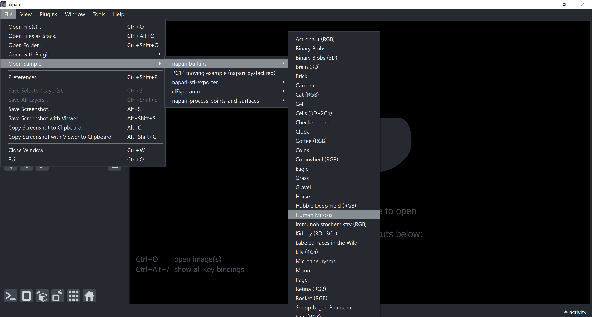

## Instance Segmentation in Napari

We will first apply the [voronoi-otsu-labeling algorithm](https://haesleinhuepf.github.io/BioImageAnalysisNotebooks/20_image_segmentation/11_voronoi_otsu_labeling.html) (from [pyclesperanto](https://github.com/clEsperanto/pyclesperanto_prototype?tab=readme-ov-file#py-clesperanto) or [nsbatwm](https://github.com/haesleinhuepf/napari-segment-blobs-and-things-with-membranes/tree/main?tab=readme-ov-file#napari-segment-blobs-and-things-with-membranes-nsbatwm)) to segment our objects (nuclei). We can do that with through the [napari-Assistant plugin]() or via the Tools menu: `Tools > Segmentation / labeling > Voronoi-Otsu-labeling`

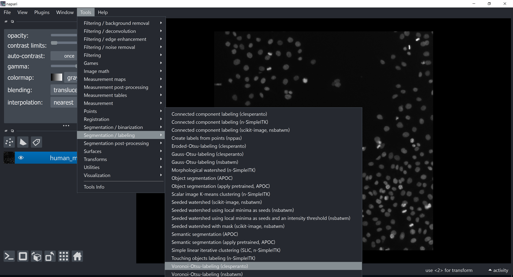

Tune the sigma parameters a bit and click on `Run`.

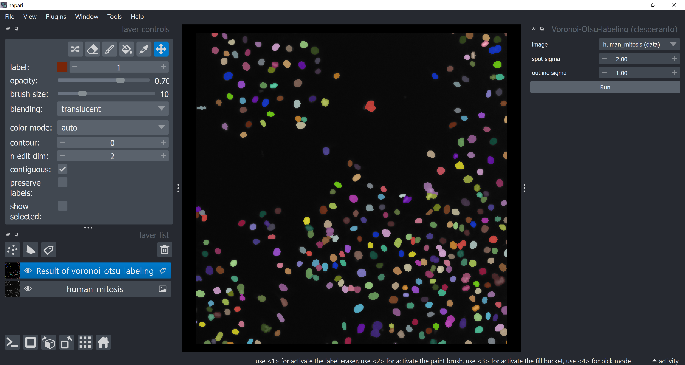

Remember that you can close/hide the widget after having used it so that your screen does not get polluted with lots of open widgets afterwards.

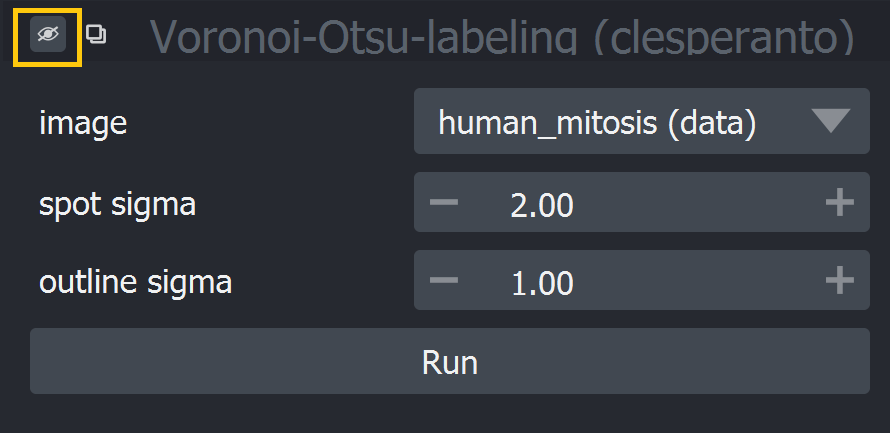

## Feature Extraction in Napari

We can extract/calculate lots of object features with the [napari-skimage-regionprops plugin](https://github.com/haesleinhuepf/napari-skimage-regionprops?tab=readme-ov-file#napari-skimage-regionprops-nsr). Open the widget via `Tools > Measurement tables > Object Features / Properties (scikit-image, nsr)`.

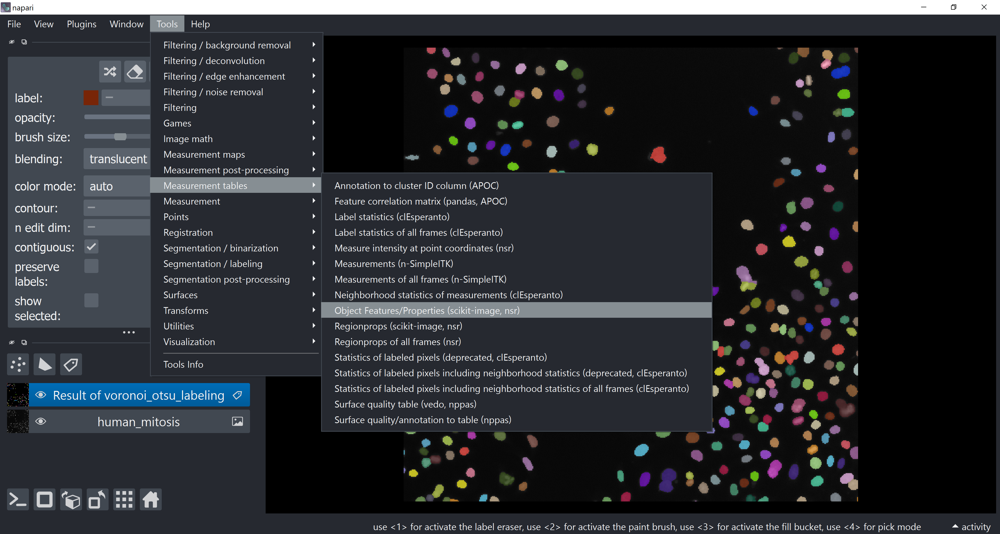

Check `intensity`, `size` and `shape` check boxes and hit the `Run` button. The `Label Image Reference` should be the layer with the segmentation results and `Intensity Image Reference` should be the original `human_mitosis` image layer from which intensity features will be taken.

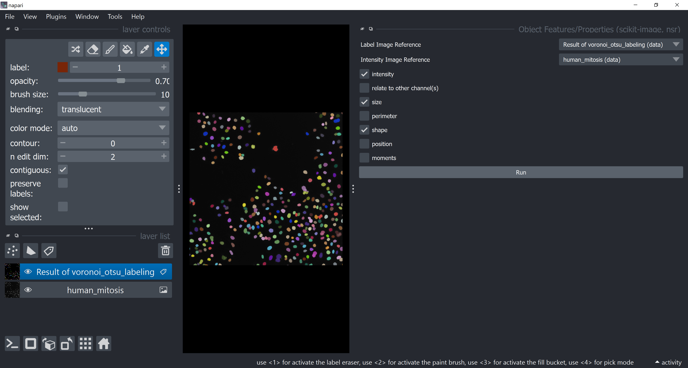

After running it, a table with the features should show up in a different tab (look at the tabs in the lower part of the screen). Feel free to explore it, but consider closing it afterwards for the same reason mentioned before (don't worry, the table will not get deleted, it is stored within the Labels layer selected at `Reference Labels Layer`).


## Plotting Features in napari

Open the [napari-clusters-plotter](https://github.com/BiAPoL/napari-clusters-plotter?tab=readme-ov-file#napari-clusters-plotter) Plotter via `Tools > Visualization > Plot measurements (ncp)`.

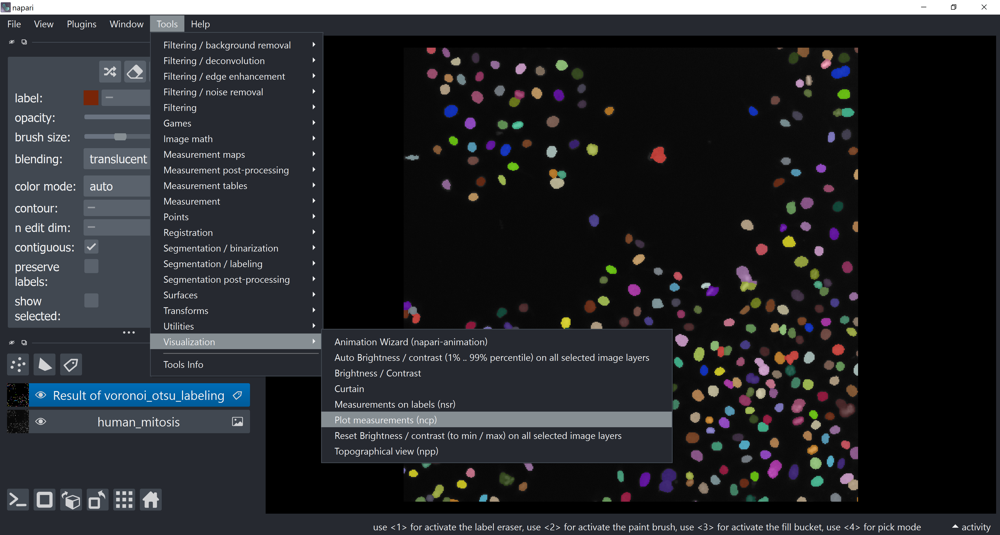

This will open a plotter. Select a few features with the `Axes` dropdown (like `area` and `mean_intensity`) and click on `Plot` to have them plotted.

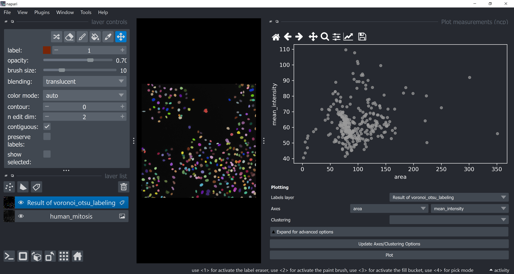

Now use the mouse to draw regions around some dots to have the corresponding objects highlighted in the main canvas as a new Labels layer. Hold `SHIFT` while dragging the cursor to have new regions with a different color (class).

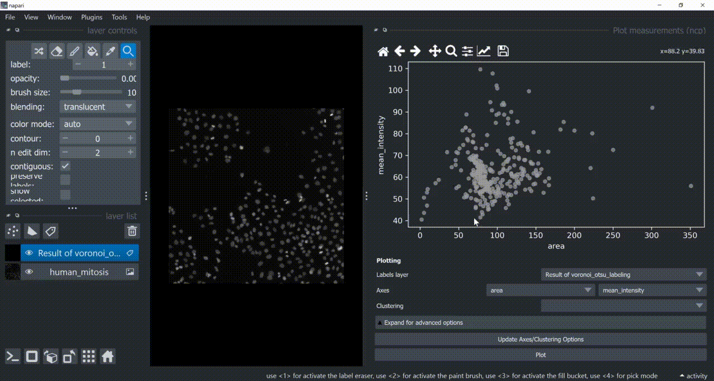

Close the plotter.

### Dimensionality Reduction

Apply UMAP to have all these dimensions reduced to 2. Do this via `Tools > Measurement post-processing > Dimensionality reduction (ncp)`. 

Choose `UMAP` under `Dimensionality Reduction Method`.  Select all measurements (while holding `SHIFT`, click on the first one, scroll down to the last one and then click on the last one). Click on `Run`.

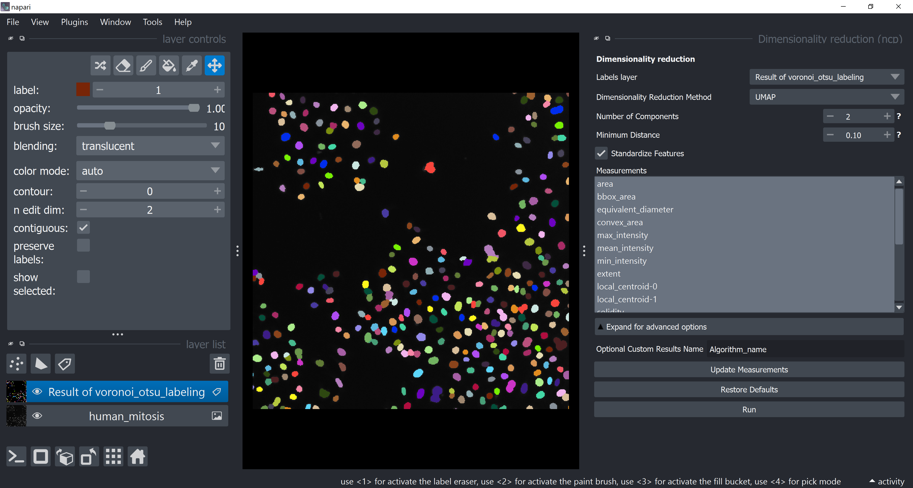

After some time, the table should pop-up again with new columns (`UMAP-0` and `UMAP-1`). Feel free to close the table and the dimensionality reduction widget.

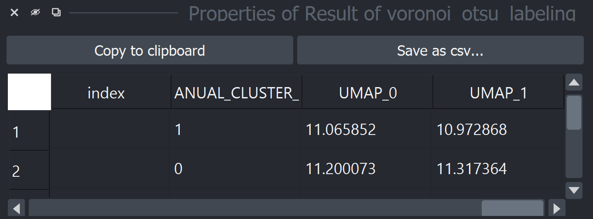

### Clustering

Apply HDBSCAN clustering by first opening the clustering widget via `Tools > Measurement post-processing > Clustering (ncp)`. Select **only** `UMAP-0` and `UMAP-1` now in `Measurements` (hold `CRTL` while clicking on them). Under `Clustering Method` choose `HDBSCAN` and click on `Run`


The table should pop-up yet again with a new `HDBSCAN_CLUSTER_ID` column. Feel free to close it.

### Visualize Object Classification Results

Open the plotter again, under `Axes` choose `UMAP-0` and `UMAP-1` and under `Clustering` choose `HDBSCAN_CLUSTER_ID`. Click on `Plot`. Try to infer why these classes were classified differently (hide and show layers or turn grid mode on to better inspect results).

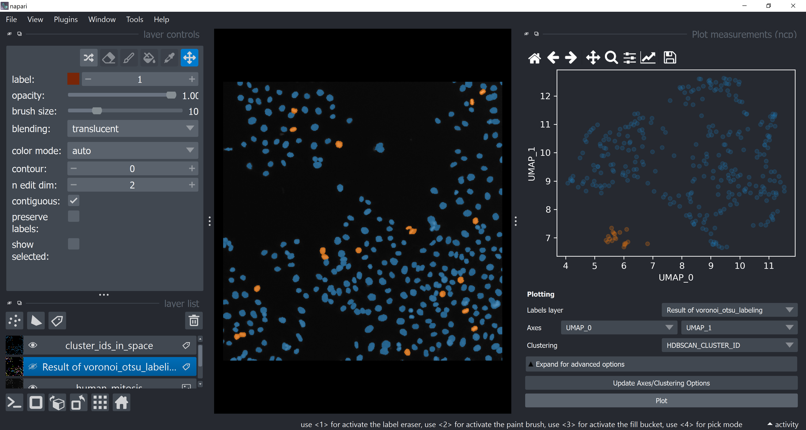

Without any ground-truth provided, we just assigned objects to different classes based on some features relationships. We just perfomed an unsupervised machine learning workflow!